# Manual Técnico: Monitoreo del sistema

## Integrantes
| Carnet | Nombre |
| ------ | ------ |
| 201404423 | Jairo Pablo Hernández Guzmán |
| 201504042 | Julio Estuardo Gómez Alonzo  |
| 201503750 | Carlos Eduardo Carías Salan |

___
## Instalación y configuración de Node Exporter

Para utilizar node exporter solo necesitaremos dos pasos, el primero es el de descargar y descomprimirlo: 
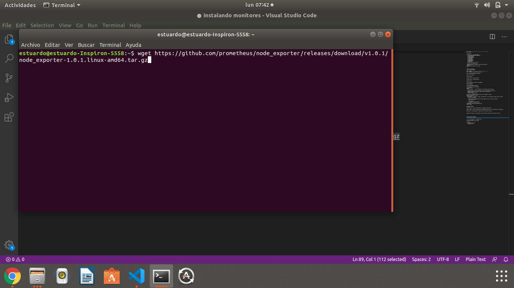

Luego de tenerlo en nuestra computadora accedemos a la carpeta en la que se encuentra y lo ejecutamos, automaticamente exporta los datos al puerto 9100
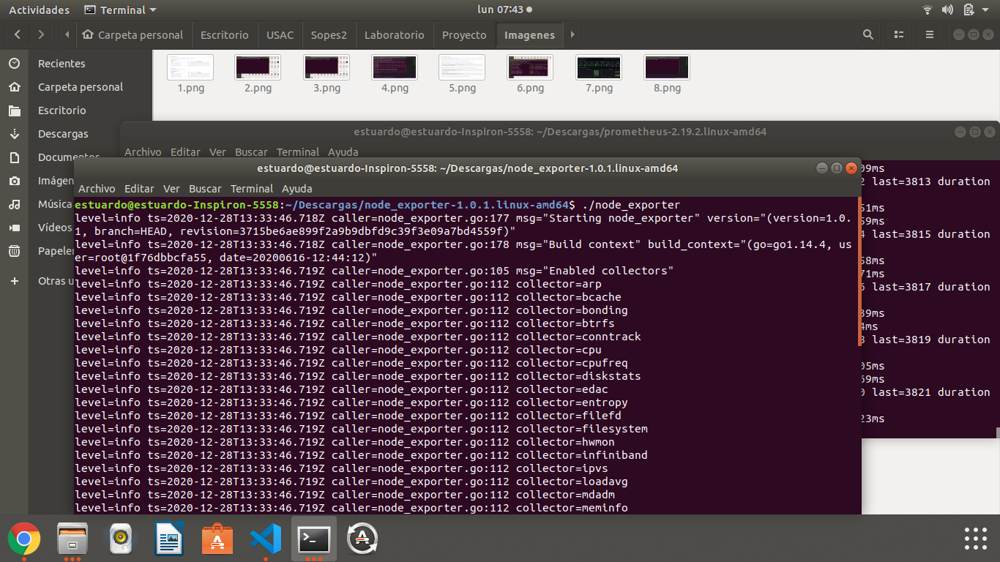

## Instalación y configuración de Prometheus

Nos dirigimos a la pagina oficial de prometheus y descargamos el que sea compatible con nuestro sistema operativo.

Extraemos el archivo comprimido que nos descarga.

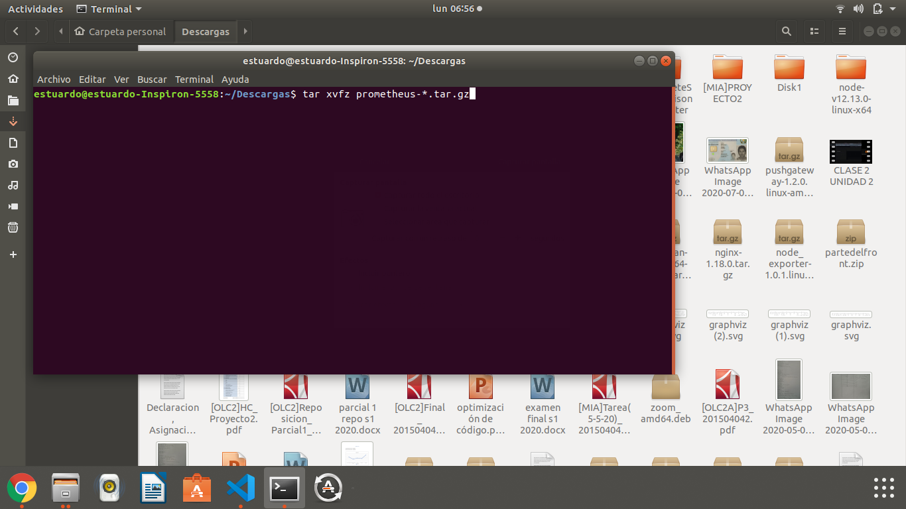

Accedemos a la carpeta en la cual nos lo descargo.

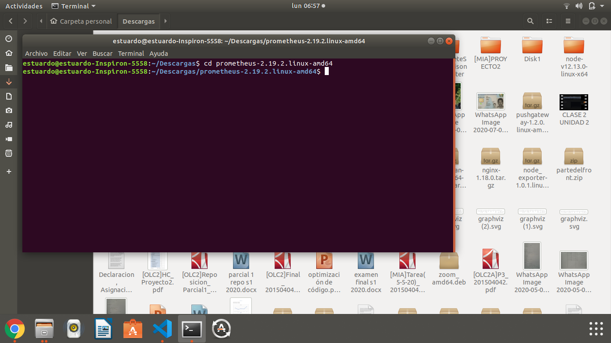

Ejecutamos prometheus, el cual por defecto funcionará en el puerto 9090 de nuestra computadora.

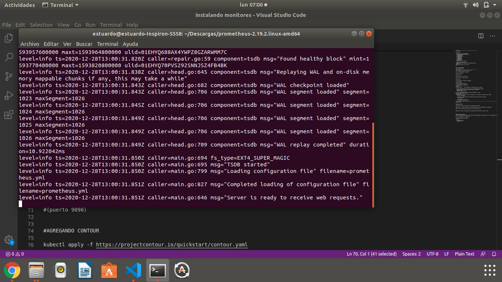

## Instalación y configuración de Grafana

Luego de tener funcionando node exporter y prometheus con esos datos, procedemos a descargar grafana en su pagina oficial:

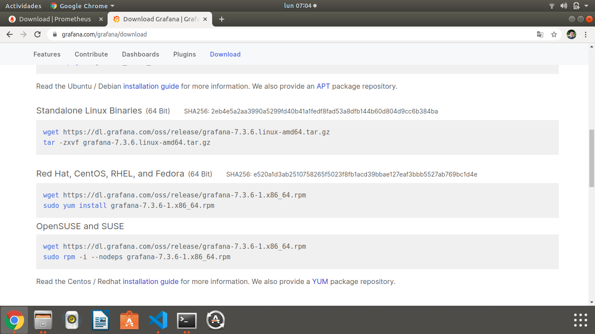

Luego de tenerlo en nuestra computadora, procedemos a descomprimir el archivo y correrlo:

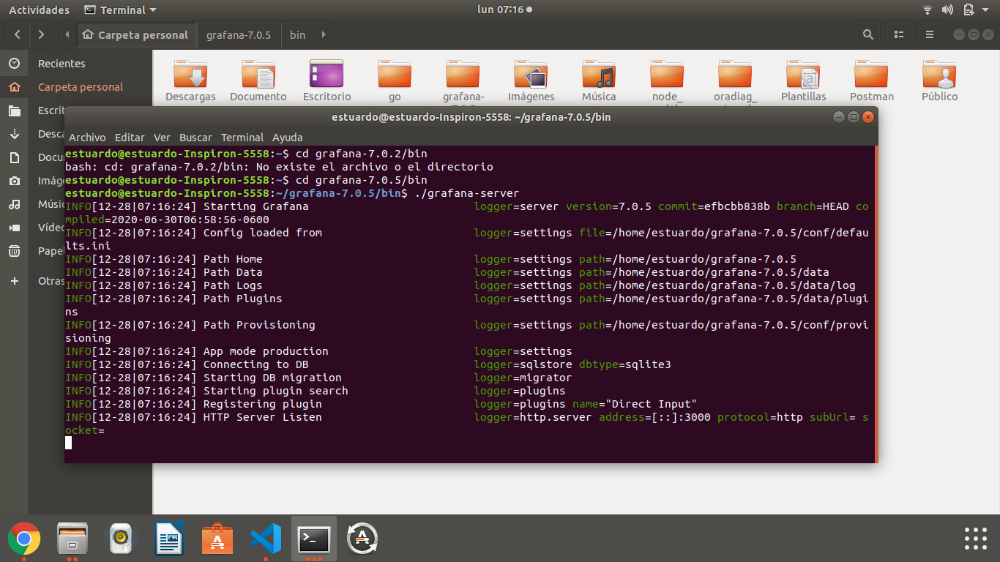

Accedemos al puerto 3000 (ya que ahí se ejecuta el programa) y en los primeros pasos que nos muestra elegimos el datasource que utilizaremos y colocamos los datos de prometheus (recordando que se encuentran en el puerto 9090):

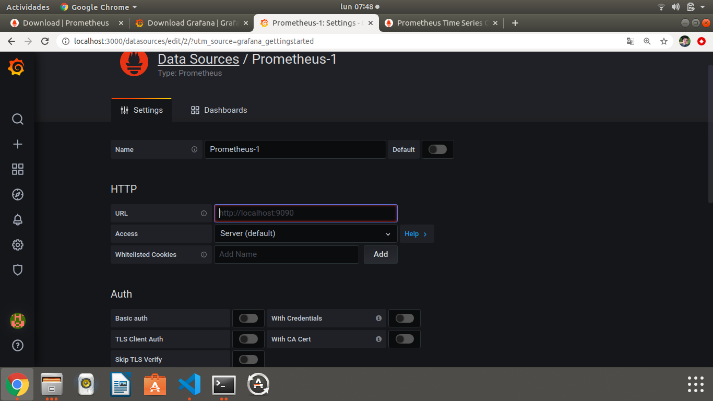

Luego de eso importamos un dashboard, en este caso utilizaremos 1860:

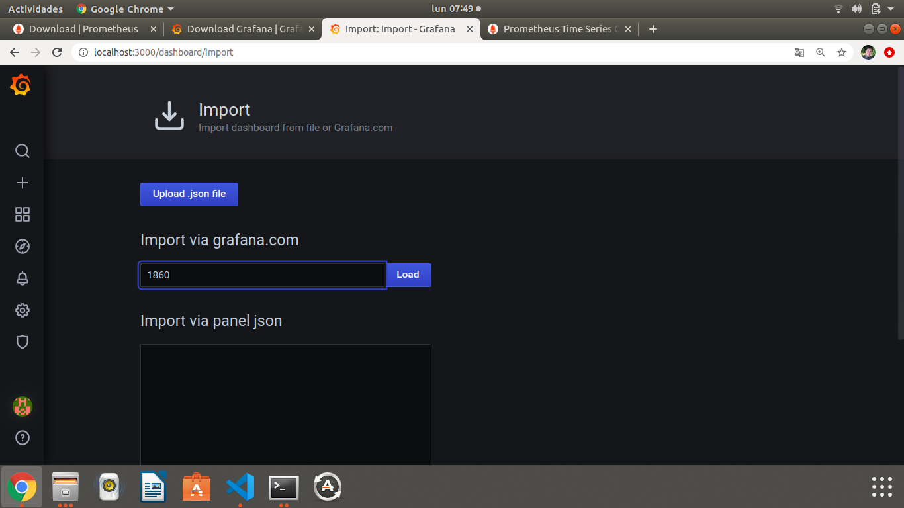

Para finalizar el dashboard, le colocamos un nombre y elegimos los datos a cargar (en este caso seria el data source creado previamente): 

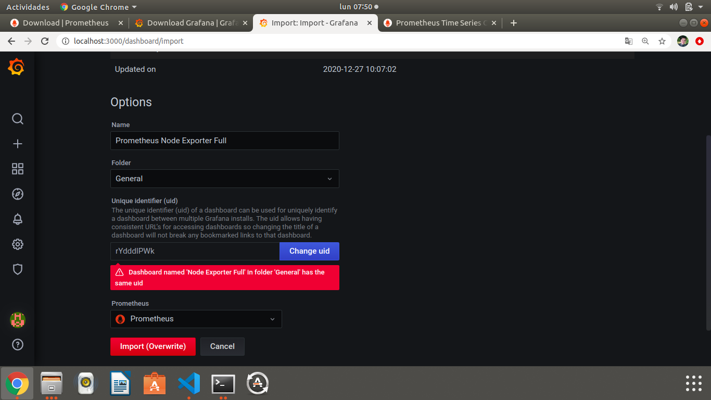

Para finalizar, abrimos el dashboard y configuramos el rango de tiempo a observar en las graficas y el tiempo en el que se actualiza: 
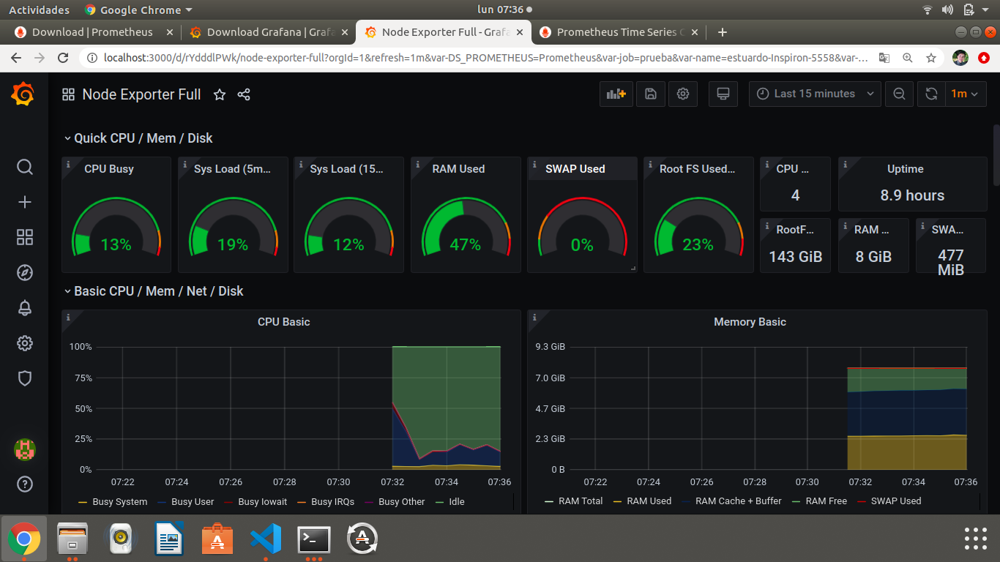
