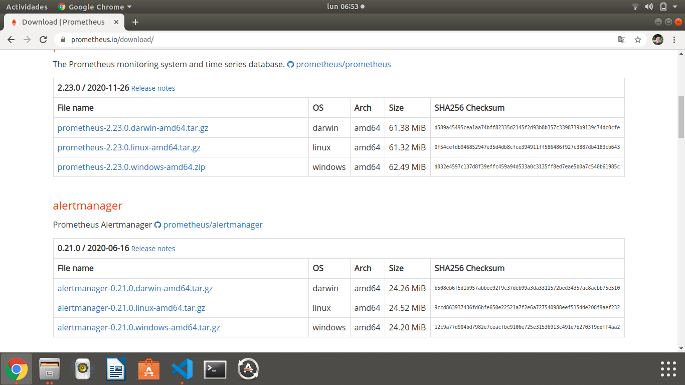

# Manual Técnico: Monitoreo del sistema

## Instalación y configuración de Prometheus

Para iniciar la configuración nos dirigimos al buscador de routers que se encuentra al lado izquierdo de la interfaz de GNS3 y arrastramos a nuestra área de trabajo el router que queramos utilizar.

